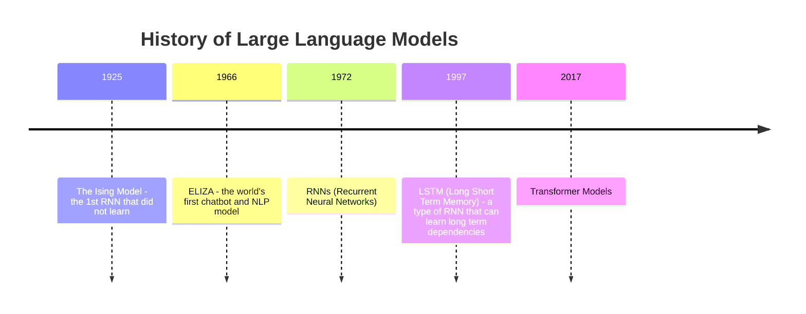
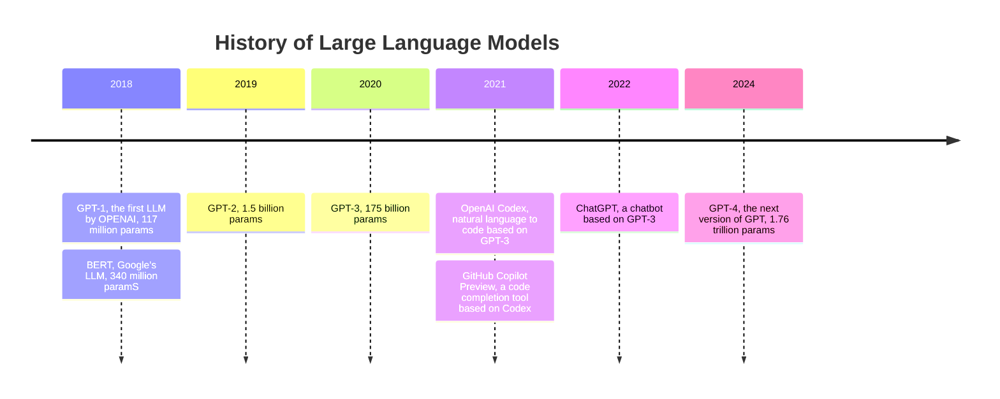

<!--
Hello good morning! Thank you all for being here with me today to learn all about large Language Models.

My goal today is to break down this technology in an easy to understand way so you can walk away feeling empowered to use them.

Now, how many of you feel like LLMs came out of nowhere and are now everywhere? Like, even though they h ave been around for a whiile, they've never been this widesppread and easily accessible in the field. And all of a sudden it's vectors, and embedding and RAG like am I gonna take a shower with AI? LOL

But seriously, I want to break down what LLMs are, how they work, and how you can build with them. And I want to show you how you can use Langchain to build your own LLM powered application.

-->

---
layout: image-right
image:  https://github.com/LadyKerr/mealmetrics-copilot/assets/47188731/7d0e2430-c5c9-483a-b8eb-afcda71e80f8
transition: fade-out
---

# Hi! I'm Kedasha!

- Jamaican gyal! 🇯🇲 
- Developer Advocate at GitHub 
- Software Developer for ~4 years 
- Technical Content Creator ✨ 
- Newly minted AI/ML enthusiast 🤖

<br>

I love, love, love creating technical content on Instagram, Tiktok and sometimes Twitter. 

**Find me online @itsthatladydev**

<style>
h1 {
  background-color: #E81CFF;
  background-image: linear-gradient(45deg, #40C9FF 10%, #E81CFF 20%);
  background-size: 100%;
  -webkit-background-clip: text;
  -moz-background-clip: text;
  -webkit-text-fill-color: transparent;
  -moz-text-fill-color: transparent;
}
</style>


<!--
introduce self
-->


---
layout: center
transition: fade-out
---

# We'll answer the following questions:

- What is an LLM?
- How were LLMs trained?
- How did we get here?
- Key Terms to know
- Demo with LangChain
- Resources to learn more
- Q&A 


<!--

Here's a quick overview of what we'll be covering today - attempt to cover today in the next 40mins or so.

-->

<style>
h1 {
  background-color: #E81CFF;
  background-image: linear-gradient(45deg, #40C9FF 10%, #E81CFF 20%);
  background-size: 100%;
  -webkit-background-clip: text;
  -moz-background-clip: text;
  -webkit-text-fill-color: transparent;
  -moz-text-fill-color: transparent;
}
</style>


<div class="absolute left-30px bottom-30px">
@itsthatladydev
</div>


---
layout: image
image: https://github.com/LadyKerr/llms-oh-my/assets/47188731/43116e62-af4e-49c6-b70e-e98fcb667a23
transition: fade-out
---

<!--

Sooo, earlier this year I embarked on a journey to learn more about AI and ML and gain some foundational knowledge in the field. I then started to learn about and build with large language models (and even built my own custom model) and I'm here to share some of that knowledge with you today.

-->

---
layout: image-left
image: https://github.com/LadyKerr/llms-oh-my/assets/47188731/0980bf0c-ed23-4f61-b978-74ff6ade15db
transition: fade-out
---

# Large Language Model (LLM)


<!--

Now, how many of you have used an LLM before? Im expecting to see a lot of hands here because of GPT-3
And how many of you actually understand what an LLMs and how they work?

-->

<style>
h1 {
  background-color: #E81CFF;
  background-image: linear-gradient(45deg, #40C9FF 10%, #E81CFF 20%);
  background-size: 100%;
  -webkit-background-clip: text;
  -moz-background-clip: text;
  -webkit-text-fill-color: transparent;
  -moz-text-fill-color: transparent;
}
</style>


<div class="absolute left-30px bottom-30px">
@itsthatladydev
</div>

<!--
Next
A large langage model is a type of generative AI that can generate human-like text. These models are trained on vast amounts of text data and are able to generate text that is coherent and contextually relevant.

It is essentially a neural network that was trained on extensive amounts of text data to generate language related tasks. This includes language translation, text summarization, and text generation.

Ok, great but what does that actually mean? Let's break it down a bit more . . .
-->

---
layout: center
image: https://github.com/LadyKerr/llms-oh-my/assets/47188731/c8bede3f-2b8f-4a36-88f8-57466eb25919
transition: fade-out
---

# Large:
## requires large amounts of data
<br />

# Language:
## understand and generate human language
<br />

# Model:
## a system that learns from data


<style>
h1 {
  background-color: #E81CFF;
  background-image: linear-gradient(45deg, #40C9FF 10%, #E81CFF 20%);
  background-size: 100%;
  -webkit-background-clip: text;
  -moz-background-clip: text;
  -webkit-text-fill-color: transparent;
  -moz-text-fill-color: transparent;
}
</style>


<div class="absolute left-30px bottom-30px">
@itsthatladydev
</div>

<!--
The word Large refers to the HUGE amounts of data that is needed to train these models. The more data you have, the better your model will be. This data can be collected from a variety of sources, such as books, articles, web scraping, transcripts, academic literature, etc.

The word Language refers to the fact that these models are able to understand and generate human language. This includes language translation, text summarization, and text generation.

And model in this context is a system that learns from data.

-->

---
layout: image
image:  https://github.com/LadyKerr/llms-oh-my/assets/47188731/c8bede3f-2b8f-4a36-88f8-57466eb25919
transition: fade-out
---


<!--

But, when we talk about AI and their relationship with LLMs, we must look at the sort of hierachal relationship that exists between the two.

AI can be considered as Mother - the parent of Machine Learning, Deep Learnig, Natural Language Processing, Generative AI and Large Language Models.

AI is the research and implementation of systems that are able to perform tasks intelligently.

ML is where computers learn from data in order to make predictions. A key thing to remember about ML is that a model is the core output and the goal is to be able to make accurate predictions on new previously unseen data.

When we get to the deep learning portion of things, this is where neural networks are used to solve complex problems. A neural network is essentially where the human brain is mimicked in a computer system. This allows computers to recognize patterns that is able to solve complex problems like image recognition, speech recognition and natural language processing (NLP).

Once we get to the NLP of things, this is where we are able to teach computers to understand and generate human language. Now Natural Language Processing  is a branch of AI that enables computers to understand language in the form of text and spoken words. And "natural language" refers to the way humans communicate with each other in their native tongue - english, spanish, french, portuguese etc. are all examples of natural languages.

NLP has many use cases such as:
- document summarization
- language translation
- automatic virtual agents and chatbots
- classifying social  media comments as positive or negative

and so on. 

Ok sooo NLP leads us to Generative AI. Generative AI is a type of artificial intelligence that is capable of generating new content, such as images, text, or music.

Some of the most common types of generative AI are:
- Generative Adversarial Networks (GANs)
- Variational Autoencoders (VAEs)
- Large Language Models (LLMs)

We'll be focusing on Large Language Models today.

BUT you can see the relationship between AI and LLMs right? AI is Mother and LLMs are the children of AI. And thanks to the multi year advanmcements in AI, we now have LLMs that are being integrated into our daily lives in ways we never thought possible or only dreamed of.

Some people dont think that LLMs are AI but when you look at these layers and how they relate to each other you can really see that without AI, LLMs would not exist.

-->

---
layout: center
transition: fade-out
---

# Popular Language Models today 

- Google **Gemini**
- Anthropic **Claude 3**
- OpenAI **GPT-4**
- Meta **Llama3**
- Mistral AI **Mistral**


<style>
h1 {
  background-color: #E81CFF;
  background-image: linear-gradient(45deg, #40C9FF 10%, #E81CFF 20%);
  background-size: 100%;
  -webkit-background-clip: text;
  -moz-background-clip: text;
  -webkit-text-fill-color: transparent;
  -moz-text-fill-color: transparent;
}
</style>


<div class="absolute left-30px bottom-30px">
@itsthatladydev
</div>


<!--

Some of the most popular LLMs today include . . .
 . .  and these are all forms of generative AI. 
To get to the point of having al these LLMs, we must first understand the building blocks of these models - transformers.

Let's take a step back in history for a second.
-->


---
layout: default
transition: fade-out
---

# Brief History of LLMs




<style>
h1 {
  background-color: #E81CFF;
  background-image: linear-gradient(45deg, #40C9FF 10%, #E81CFF 20%);
  background-size: 100%;
  -webkit-background-clip: text;
  -moz-background-clip: text;
  -webkit-text-fill-color: transparent;
  -moz-text-fill-color: transparent;
}
</style>


<div class="absolute left-30px bottom-30px">
@itsthatladydev
</div>

<!--

In the 60's ELIZA was created by an MIT researcher and was able to hold a conversation with a human user by following a pre-written script.
This was revolutionary at the time and many felt like they were talking to a real person.

Flash forward a few years and we had RNNs and LSTMs. RNNs were actually able to learn. They were the first technology that was able to predict the  next word in a sentence and not have everything pre-programmed for it. REVOLUTIONARY! They're actually a part of popular tech today like Siri, Alexa and Google Translate.

Long Short Term Memory were able to learn from data and generate text and started to revolutionize speech recognition and machine translation in the early 2000s.

Then, in 2017, Google introduced Transformer models. Transformers were invented for a specific task: translate text from one language into another. They were able to translate text from one language to another with a high degree of accuracy. They were able to do this by understanding the context of a word in a sentence in relation to other words in the sentence. This is what makes transformers so powerful.

These models were neural networks that were able to learn context, and find relationships between words in a sentence. This was a game changer in the world of NLP and the foundation for the LLMs we have today.

Because of transformers, we can produce an image from text, produce audio from text, create videos from text, and even generate code from text.

They are also called Foundation Models and they use attention or self attention to figure out the subtleties of language. This was revolutionary and everytime we search on Google, we are using a transformer model.
-->


---
layout: default
transition: fade-out
---

# Brief History of LLMs (cont'd)



<style>
h1 {
  background-color: #E81CFF;
  background-image: linear-gradient(45deg, #40C9FF 10%, #E81CFF 20%);
  background-size: 100%;
  -webkit-background-clip: text;
  -moz-background-clip: text;
  -webkit-text-fill-color: transparent;
  -moz-text-fill-color: transparent;
}
</style>


<div class="absolute left-30px bottom-30px">
@itsthatladydev
</div>

<!--

Then in 2018, we got the Generative Pre-trained Transformer 1 (GPT-1), the first large language model introduced by OPENAI that utilized Google's Transformer model. It had 117 million parameters which is like.

Once transformers and GPT-1 came to the scene, things started to move pretty rapidly. In 2018, BERT was introduced by Google. Then in 2019, we got GPT-2, from OPEN-AI, then GPT-3 in 2020. GPT-3 had 175 billion parameters and was the largest LLM at the time.

Then in 2021, we got Codex, a natural language to code model based on GPT-3. And then GitHub Copilot Preview, a code completion tool based on Codex. And then in 2022, we got ChatGPT, a chatbot based on GPT-3.

And that changed EVERYTHING.

ChatGPT was the first LLM that was able to hold a conversation with a human user and it was able to generate human-like text that was coherent and contextually relevant. IT WAS AMAZING!! Do you remember the first time you used chatGPT?? I do! It was like magic!

And so, Transformers truly changed everything and is the basis for how LLMs work today. Let's take a deeper look at how LLMs actually work and how they were built.
-->

---
layout: section
transition: fade-out
---

# How were LLMs built?


<style>
h1 {
  background-color: #E81CFF;
  background-image: linear-gradient(45deg, #40C9FF 10%, #E81CFF 20%);
  background-size: 100%;
  -webkit-background-clip: text;
  -moz-background-clip: text;
  -webkit-text-fill-color: transparent;
  -moz-text-fill-color: transparent;
}
</style>


<div class="absolute left-30px bottom-30px">
@itsthatladydev
</div>


---
layout: intro
transition: fade-out
---


<style>
h1 {
  background-color: #E81CFF;
  background-image: linear-gradient(45deg, #40C9FF 10%, #E81CFF 20%);
  background-size: 100%;
  -webkit-background-clip: text;
  -moz-background-clip: text;
  -webkit-text-fill-color: transparent;
  -moz-text-fill-color: transparent;
}
</style>


<div class="absolute left-30px bottom-30px">
@itsthatladydev
</div>

<!--

Ok so when we give a text to a language model, the text is broken up into tiny pieces called tokens. Each token is then converted into a numerical representation (vector) that the model can understand. The model then uses these numerical representations to generate text that is similar to the text it was trained on.

Now how does this actually work? How does a model do all this?

Training a LLM typically has the folowing staps:
- Data Collection
- Tokenization
- Model Training
- Evaluation and Testing

Well it all starts with Data. The first step of training a LLM is gathering large amounts of text data. Think billions and billions of words. This dataset can be collected from a variety of sources, such as books, articles, web scraping, transcripts, academic literature, etc. The more data you have, the better your model will be. However, if you have terrible data foiing into your model, you'll get terrible results. This means, if your data contains biases, racism, sexism, etc., your model will learn these biases and reproduce them in its output.

So an essential step in data collection is data cleaning - removing duplicates, unimportant words of phrases, makiing all text lowercase and so on.

Once we have a good dataset, the tokenization stage is next. This is where text is broken down into pieces and each piece is converted into a token. So a token could be a phrase, a single word, or punctuation.

After tokenization, the tokens are converted into numerical representations that the model can understand. This prpcess is called embedding - mapping tokens to vectors (and vectors are just a list of numbers).

And then once that's done, we have the training step. So the model learns to answer questions and make predictions based on the dataset. The datset is used to train it. Then we evaluate and test the model.

This whole process can take weeks, months or even years to complete. And the model is trained on expensive and powerful computer chips to speed up the process.

But essentially, this is how we get to have LLMs. And if you notice, it's a lot of big companies that are able to build these models because of the intense resources needed to train them.
-->

---
layout: intro
transition: fade-out
---

# Key LLM Terms to know


```python {5-6|7|8|9|10|11|12|13|14|all}{lines:true, startLine:5}
def llm_key_terms():
  terms = {
    'tokens': 'a single unit of text',
    'embedding': 'convert tokens into vectors',
    'vectors': 'numerical representations of tokens',
    'vectorstore': 'a database that stores vectors',
    'transformers': 'neural network architecture used in LLMs',
    'pre-training': 'training a model on a large dataset of text',
    'fine tuning': 'training a pre-trained model on a specific task',
    'RAG' : 'prompting method that uses retrieval to add more context to a prompt',
  }
  return terms
```

<style>
h1 {
  background-color: #E81CFF;
  background-image: linear-gradient(45deg, #40C9FF 10%, #E81CFF 20%);
  background-size: 100%;
  -webkit-background-clip: text;
  -moz-background-clip: text;
  -webkit-text-fill-color: transparent;
  -moz-text-fill-color: transparent;
}
</style>


<div class="absolute left-30px bottom-30px">
@itsthatladydev
</div>

<!--

Ok so that was qite a  bit of information to take in. But let's simplify it a bit by looking at some key terms that you should know when working with LLMs, and thinking about LLMs:

- Tokens: A token is a single unit of text. It could be a word, a phrase, a punctuation mark, or a number. Tokens are the building blocks of language models.

- Embeddings: Embedding is the process of converting tokens into numerical representations that the model can understand. These numerical representations are called vectors.

- Vectors: Vectors are lists of numbers that represent tokens in a sentence.

- Transformers: Transformers are a type of neural network architecture that is used in LLMs. They are able to learn context and relationships between words in a sentence. They are the foundation of LLMs.

- Pre-training: Pre-training is the process of training a model on a large dataset of text before fine-tuning it on a specific task. 

- Fine Tuning: Fine-tuning is the process of training a pre-trained model on a specific task or dataset. It is used to adapt the model to a specific use case.

- RAG: Retrieval-Augmented Generation: feeding a model a set of documents, and asking it to generate a response based that document. The LLM will then use that data source to form it's responses.

RAG is a prompting method that uses retrieval—a process for searching for and accessing information—to add more context to a prompt that generates an LLM response.

You will hear and have probably heard these words being thrown around all the time online when folks talk about LLMs. So it's good to know what they mean.

-->

---
layout: center
transition: fade-out
---

# Building with an LLM:


<style>
h1 {
  background-color: #E81CFF;
  background-image: linear-gradient(45deg, #40C9FF 10%, #E81CFF 20%);
  background-size: 100%;
  -webkit-background-clip: text;
  -moz-background-clip: text;
  -webkit-text-fill-color: transparent;
  -moz-text-fill-color: transparent;
}
</style>


<div class="absolute left-30px bottom-30px">
@itsthatladydev
</div>

<!--

There are a few ways to build with a pre-trained LLM, BUT today I want to introduce you to Langchain.

Langchain is a framework that was developed to make it easier for any developer to build their own LLM powered application. It currently suports 2 languages - Python and Javascript and allows you to interact with multiple LLMs without losing your mind.

So with Langchain you can use, GPT-4, Gemini, Claude, all in one place. And you can use then chain responses together to create a more complex response.

-->

---
layout: section
transition: fade-out
---

# Live Demo

## **repo**: gh.io/langchain-copilot

<style>
h1 {
  background-color: #E81CFF;
  background-image: linear-gradient(45deg, #40C9FF 10%, #E81CFF 20%);
  background-size: 100%;
  -webkit-background-clip: text;
  -moz-background-clip: text;
  -webkit-text-fill-color: transparent;
  -moz-text-fill-color: transparent;
}
</style>


<div class="absolute left-30px bottom-30px">
@itsthatladydev
</div>

<!--

So for example, I have this demo here, and with Langchain, we have a simple LLMChain here where it revceives 1 input and generates 1 output. This is the simplest chain there is. There is also a sequential chain, where the output of the first chain is the input of the second chain and so on.

So here I have 4 chains, and you can see here Im using the simple LLMChain to construct these, and Im using the GPT-4 model to generate the responses.

When I run this code, you can see that the output is going to be from this final chain here and Im going to get some similar fragrances to the notes I inputted.

These notes are coming from a dataset that I have and it's just a single line - line 5.

But what if I wanted the LLM to take a look at my dataset and provode me with similar fragrances from my dataset? I can do that by convertinig my dataset into a document and then feeding that document to the LLM.

Let's take a look at how we can accomplish that . . .


So I have some comments here that's kinda telling us what we need to do.

The first thing Im going to do is import all the necessary libraries and such I need from langchain. So I have the ChatOpenAI and OpenAIEmbeddings from openai, and I have the CharacterTextSplitter that's going to produce my tokens, then I have the CSVLoader that'll take my dataset and convert it into a document that I need. I hav ethe DocArryInMemorySearch that I'll use for my vectorstore and then I have this Markdown one that's going to format my display nicely here.

Let's run this cell and then move on.

so, first I need to create my document

Then I need to split my text into characters

Then I'm going to create my embeddings

and finally my vectorstore - and I'll pass my tokens and embeddings to my vectorstore.

Once that's done, I can perform a similarity search on my vectorstore and get the most similar fragrances to a fragrance I like.


And there we go.

Now let's take it a step further. We can create a retriever like this, then create a function that joins the documents that will be returned, then create a prompt template like this one, and notice a var called context - this context is the retriever which is our vectorstore.

we can go ahead and create a rag prompt from our template then create a rag chain like this:
context will be the retriever and also the qdocs function - the results from the retriever will be fed into qdocs for formatting, then we pass the rag prompt, the llm, this StrOutputParser to parse those strings and our display markdown function here. 

When I run this, we should get a response.

Oh! something's not right, hmm. I think my qdocs var need to be updated. Hmm, let me feed this error into gh copilot chat . . . ahh I see, it needs to be a function. OK let's make this a function . . .

run the code again and hmm, output is crazzy LOL

Oh! I see the problem I think, lemme ask copilot chat for help again.

Yea, I need to make sure my display markdown also a function. Let's fix that.

Ok, run this again and there we go, we have 3 similar frgrances that's coming right from our vectorstore! Working with LLMS and Langchain can be so fun because I can just switch the llm Im using by chaing one line here - and I can use any LLM I want. 

-->

---
layout: center
transition: fade-out
---

# Resources

repo: gh.io/langchain-copilot


<style>
h1 {
  background-color: #E81CFF;
  background-image: linear-gradient(45deg, #40C9FF 10%, #E81CFF 20%);
  background-size: 100%;
  -webkit-background-clip: text;
  -moz-background-clip: text;
  -webkit-text-fill-color: transparent;
  -moz-text-fill-color: transparent;
}
</style>


<div class="absolute left-30px bottom-30px">
@itsthatladydev
</div>

<!--

So, that's all I had for you today. If you want to keep learning more about LLMs, check out these resourtces an dif you want to jumpstart your generative AI journey, check out this repo for some resoiurces on getting started!

Lemme know if you have questions, comments or just good vibes! Ok cool byee!

-->
